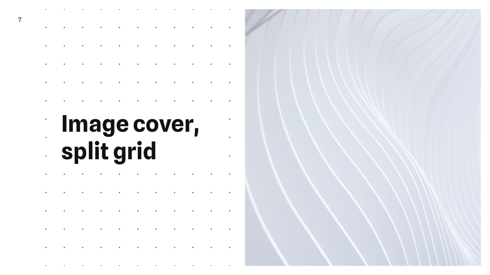

# Basetype slide theme

Basetype is a slide deck theme for the [Marp presentation ecosystem](https://marp.app/). It's not the prettiest, but it will do.

<table>
<tr>
<td></td>
<td></td>
</tr>
</table>
<table>
<tr>
<td></td>
<td></td>
<td></td>
</tr>
<tr>
<td></td>
<td></td>
<td></td>
</tr>
</table>

<details>
<summary>Usage with VSCode</summary>

- Install the [Marp VSCode extension](https://marketplace.visualstudio.com/items?itemName=marp-team.marp-vscode)

- Make a new workspace for your slide deck. Update `.vscode/settings.json` in your workspace with:

  ```json
  {
    "markdown.marp.enableHtml": true,
    "markdown.marp.themes": ["./themes/basetype.css"]
  }
  ```

- Create `./themes/basetype.css`:

  ```css
  /* @theme basetype */
  @import url("https://cdn.jsdelivr.net/gh/rstacruz/marp-basetype@v0.0.1/basetype.css");
  ```

- Create your first presentation: (eg, `hello.md`)

  ```js
  ---
  marp: true
  theme: basetype
  ---

  # Hello from Marp!
  This is a presentation.
  ```

- Open the Markdown preview and enjoy (`ctrl-k v`) 🎉

</details>
